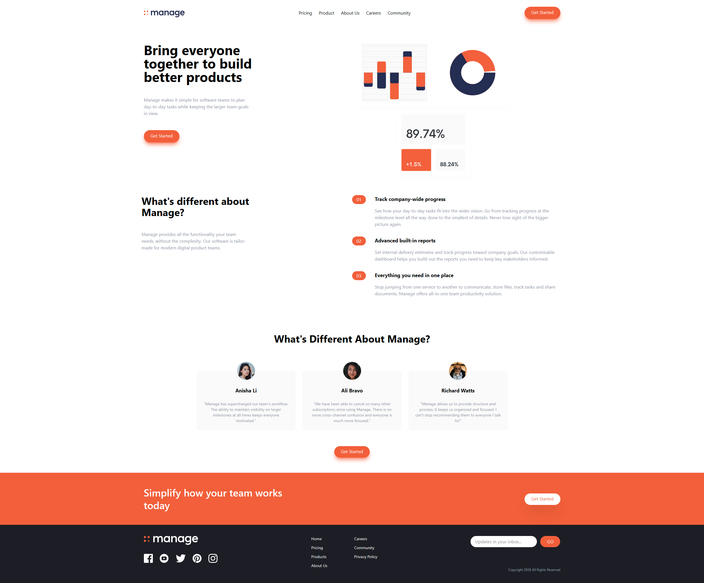

# Frontend Mentor - Manage landing page solution

This is a solution to the [Manage landing page challenge on Frontend Mentor](https://www.frontendmentor.io/challenges/manage-landing-page-SLXqC6P5). Frontend Mentor challenges help you improve your coding skills by building realistic projects. 

## Table of contents

- [Overview](#overview)
  - [The challenge](#the-challenge)
  - [Screenshot](#screenshot)
  - [Links](#links)
- [My process](#my-process)
  - [Built with](#built-with)
  - [What I learned](#what-i-learned)
  - [Continued development](#continued-development)
  - [Useful resources](#useful-resources)
- [Author](#author)
- [Acknowledgments](#acknowledgments)

## Overview

### The challenge

Users should be able to:

- View the optimal layout for the site depending on their device's screen size
- See hover states for all interactive elements on the page

### Screenshot

### Links

- Solution URL: [https://www.frontendmentor.io/solutions/manage-landing-page-using-tailwind-cli-IRctC1hVC4](https://www.frontendmentor.io/solutions/manage-landing-page-using-tailwind-cli-IRctC1hVC4)
- Live Site URL: [https://adyan5786.github.io/Manage-Landing-Page/](https://adyan5786.github.io/Manage-Landing-Page/)

## My process

### Built with

- [Tailwind CLI](https://tailwindcss.com/)
- Semantic HTML5 markup
- CSS custom properties
- JavaScript
- Flexbox
- Mobile-first workflow
- Github Pages

### What I learned

I've learned the basics of Tailwind and how to deploy website onto Github Pages, since it's an entirely different process if the project is done with Tailwind CLI.

### Continued development

Tailwind CSS is currently one of the most popular and rapidly growing utility-first CSS frameworks. Perfecting Tailwind will be the goal as I continue to make more projects on it.

### Useful resources

- [Tailwind CLI](https://tailwindcss.com/docs/installation/tailwind-cli) - Documentation for the installation and setup of Tailwind CLI for the development of the project. 
- [Github Pages](https://pages.github.com/) - Documentation for the deployment of the website using Github Pages. Didn't use it as much but still helpful for some parts of the deployment process.

## Author

- Name - Adyan Shaikh
- Frontend Mentor - [@adyan5786](https://www.frontendmentor.io/profile/adyan5786)

## Acknowledgments

This project was done while learning about Tailwind through the Crash Course from Brad Traversy (YouTube Channel: [Traversy Media](https://www.youtube.com/@TraversyMedia))
